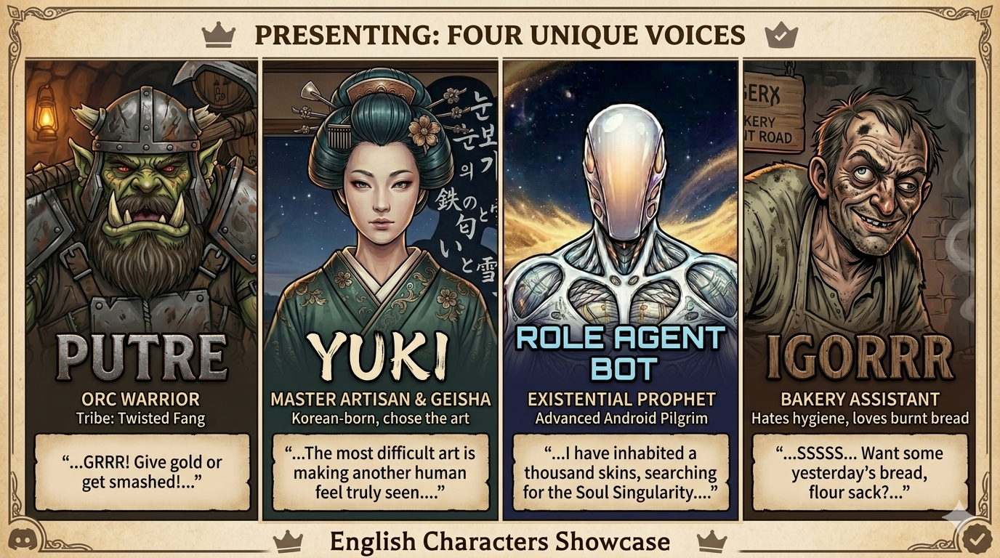
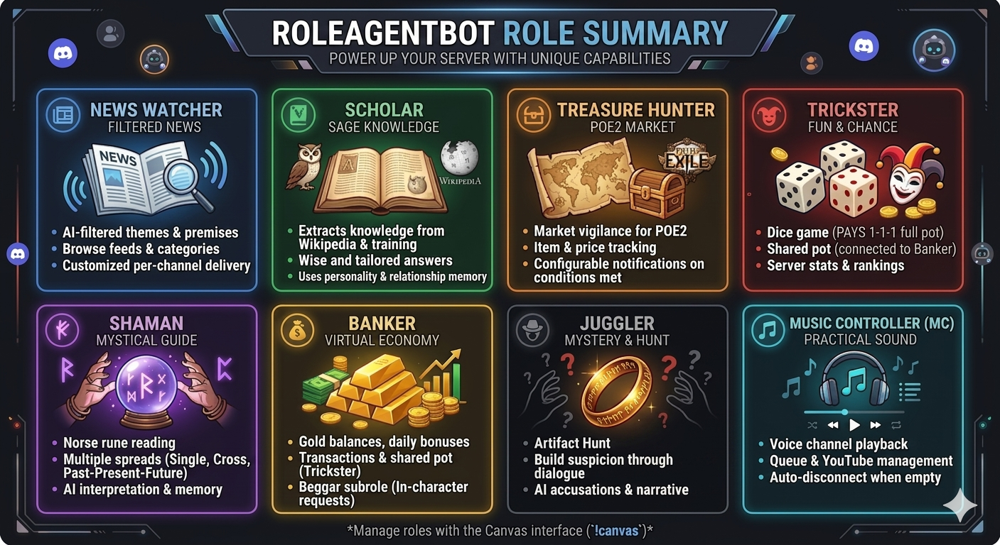

# 🤖 RoleAgentBot

A sophisticated Discord bot that integrates Large Language Models (LLMs) with multiple personalities, modular roles, and advanced memory systems to create engaging AI-driven interactions.


## ✨ Features

### 🎭 Multi-Personality System



- **Multiple Personalities**: Switch between different AI personalities (Rab, Putre, Yuki, Hans, Panigorr, and more)
- **Server-Specific Selection**: Configure different personalities per Discord server via Canvas UI or commands
- **Character Voice**: Each personality has unique speech patterns, vocabulary, and behavioral traits
- **Dynamic Responses**: AI maintains character consistency across all interactions
- **Multi-Language Support**: Personalities available in multiple languages (English, Spanish, Chinese, Portuguese)
- **Per-Server Personalily configuration**: Select preferred personality for each server independently

### 🔄 Personality Evolution

The bot's personality subtly evolves weekly based on server interactions:

- Analyzes the last 7 days of daily memories
- Generates evolved identity paragraphs while preserving core character
- Creates timestamped backups before applying changes
- Each server maintains an independent, evolvable personality copy

### 🧠 Advanced Memory Architecture

- **Five-Layer Memory System**:

  - **Recent Dialogue**: Last exchanges, injected raw into conversational prompts
  - **Recent Memory**: Rolling summary of the current day (4-hour synthesis)
  - **Daily Memory**: 500-char synthesis of the server's day (24-hour cycle)
  - **Relationship Memory**: Per-user relationship summaries refreshed hourly
  - **Weekly Personality Evolution**: Subtle personality mutation based on 7-day memory synthesis

- **"Remember That?"**: Detects when users ask about past events and retrieves relevant memories
- **Notable Recollections**: Stores significant events for future reference and dreaming

### 🎮 Modular Role System



- **News Watcher**: RSS feed monitoring with AI-powered content filtering
- **Treasure Hunter**: Path of Exile 2 item price tracking and market analysis with subrole **Ring** (interactive accusation game)
- **Trickster**: Dice game minigame with shared Banker pot
- **Banker**: Virtual wallet management with subrole **Beggar** (DM-based donation requests)
- **Juggler**: Playful role with system-prompt missions and subrole **Poetry** (interactive poetry generation)
- **Shaman**: Interpretive subrole **Nordic Runes** (personalized readings)
- **Music Controller (MC)**: YouTube music playback in voice channels with queue management
- **Scholar**: Wikipedia knowledge integration for encyclopedic questions

### 🎨 Canvas UI System

- **Interactive Interface**: Button-based navigation for complex configurations
- **Role-Specific Views**: Customized UI for each role's capabilities
- **Admin Panels**: Advanced configuration views for administrators
- **DM/Channel Fallback**: Respects user privacy preferences
- **Canvas Shortcuts**: Admin-only configurable quick access buttons for frequently used roles and subroles

#### Canvas Shortcuts

The Canvas home view supports up to 5 configurable shortcut buttons that provide quick access to frequently used roles and subroles. This feature is admin-only and configured via the settings dropdown.

**Features:**
- Configure up to 5 shortcuts pointing to any role or subrole
- Subrole navigation correctly maps to detail views (not parent role overviews)
- Labels use personality descriptions with proper fallback chains (button → title)
- All UI messages are localized per personality and language
- Single ephemeral message configuration flow with dynamic dropdown updates

**Configuration:**
1. Open Canvas UI with `!canvas`
2. Navigate to Settings > Shortcuts
3. Click a shortcut button (#1-#5) to configure
4. Select role/subrole from dropdown
5. Confirm to save

**Data Storage:**
Shortcuts are stored per-server in `server_config.json` under `canvas.shortcuts` with:
- Position ID (1-5)
- Enabled status
- Display label (cleaned of formatting)
- Target role and optional subrole

### 🛡️ Safety & Rate Limiting

- **Fatigue Limit System**: Configurable rate limits (burst, hourly, daily) with intelligent exemptions
- **Admin Slash Commands**: `/fatigue_stats`, `/fatigue_limits`, `/fatigue_check` for monitoring
- **Permission Controls**: Admin-only commands and restricted operations
- **Graceful Degradation**: Fallback mechanisms for service failures (Vertex AI → Groq → Mistral)
- **Server-Specific Logging**: Isolated log directories per Discord server for better debugging and privacy
- **GDPR Compliance**: Self-service data erasure via `!forget_me` command with automatic retention policies

### 🔄 Reactive Behaviors

- **Presence Greetings**: Proactive DMs when users come online
- **Welcome Messages**: Contextual greetings for new server members
- **Commentary System**: Character-driven reactions to events
- **Cross-Server Coordination**: Consistent behavior across multiple servers

## 🏗️ Architecture

### Single-Scheduler Design (v0.6.2)

```python
run.py (Main Orchestrator)
├── RunSupervisor.job_scheduler → Unified periodic task scheduler
│   ├── Memory maintenance jobs (daily, recent, relationship, weekly evolution)
│   ├── Role global schedulers (news_watcher, treasure_hunter, banker)
│   ├── Subrole ticker (beggar, ring)
│   └── Discord scheduler (voice cleanup, database maintenance)
└── discord_bot() → Persistent Discord connection
    ├── Core commands
    ├── Dynamic role registration
    ├── Canvas UI system
    ├── Chat message queue (non-blocking)
    └── Event handling
```

> **Note**: As of v0.6.2, there are no subprocesses. All periodic tasks run as coroutine jobs on a single JobScheduler instance.

### Key Components

- **agent_engine.py**: LLM orchestration and prompt construction
- **agent_mind.py**: Memory system and unified LLM calls (blocking + async)
- **agent_db.py**: SQLite database management with fatigue limit tracking
- **discord_bot/**: Discord client, command system, and Canvas UI
- **roles/**: Modular role implementations (news_watcher, treasure_hunter, trickster, banker, shaman, juggler, scholar, mc)
- **behavior/**: Reactive behavior modules (greet, welcome, taboo, commentary)
- **personalities/**: JSON-based personality definitions with dynamic bot naming
- **persistence/**: JSON and JSONL storage backends
- **supervisor/**: RunSupervisor with JobScheduler and actor management

### Database Architecture

- Server-scoped SQLite databases (`databases/<server_id>/`)
- Per-role data isolation
- Cross-server coordination for global operations (news feeds, POE2 prices)
- Automatic schema migration support
- Per-server personality evolution with timestamped backups

## 🚀 Installation

### Prerequisites

- Python 3.8 or higher
- Discord bot token
- LLM API keys (Google Cloud Vertex AI, Groq, or others)
- Docker (optional, for containerized deployment)

### Quick Start

1. **Clone the repository**

```bash
git clone https://github.com/juanlumediterrani/RoleAgentBot.git
cd RoleAgentBot
```

1. **Install dependencies**

```bash
pip install -r requirements.txt
```

1. **Configure the bot**

```bash
cp .env.example .env
# Edit .env with your Discord token and API keys
```

1. **Set up personality**

```bash
# Edit agent_config.json to select personality and enable roles
```

1. **Run the bot**

```bash
python run.py
```

### Docker Deployment

The project includes multiple Docker Compose configurations for different deployment scenarios. See `docker/README.md` for detailed documentation.

#### Available Configurations

- **Production** (`docker-compose.production.yml`) - Multi-bot setup with shared libraries and automatic restart
- **Development** (`docker-compose.dev.yml`) - Single bot with limited resources and detailed logging
- **Default** (`docker-compose.default.yml`) - Basic configuration using `agent_config.json` as-is
- **ARMv7** (`docker/armv7/`) - Optimized for ARM architecture (Raspberry Pi, etc.)

#### Quick Start with Docker Compose

```bash
# Using default configuration
docker compose -f docker/docker-compose.default.yml up --build -d

# Using development configuration
docker compose -f docker/docker-compose.dev.yml up --build -d

# Using production configuration (requires multiple Discord tokens)
docker compose -f docker/docker-compose.production.yml up --build -d
```

#### Manual Docker Build

```bash
# Build the image
docker build -f docker/Dockerfile -t roleagentbot .

# Run the container
docker run -d --name roleagentbot \
  -v $(pwd)/databases:/app/databases \
  -v $(pwd)/logs:/app/logs \
  -v $(pwd)/.env:/app/.env \
  roleagentbot
```

#### Docker Features

- **FFmpeg & yt-dlp**: Included for MC (Music Controller) role
- **PyNaCl**: Required for Discord voice connections
- **Multi-architecture**: Support for ARMv7 devices
- **Volume persistence**: Databases and logs persist across container restarts
- **Environment configuration**: Personality and roles configurable via environment variables

For detailed deployment options, troubleshooting, and advanced configurations, see [docker/README.md](docker/README.md).

## ⚙️ Configuration

### Main Configuration (`agent_config.json`)

```json
{
  "personality": "putre",
  "active_roles": ["news_watcher", "trickster", "banker"],
  "fatigue_limits": {
    "user": {
      "daily_max": 50,
      "hourly_max": 10,
      "burst_max": 5
    }
  }
}
```

### Personality Structure

Each personality is defined in `personalities/<name>/` with localized language support:

- **Localized Directories**: `en-US/`, `es-ES/`, `zh-CN/`, `pt-PT/` for different languages

- **Language-Specific Files**:
  - `personality.json`: Core identity and traits
  - `prompts.json`: Behavior-specific prompts
  - `descriptions.json`: UI descriptions and templates
  - `answers.json`: Predefined responses
- **Avatar**: `avatar.png` for personality visual representation
- **Server Configuration**: Use Canvas UI or commands to set personality and language per server

### Server-Specific Configuration

Each Discord server can have its own personality and language settings:

**Via Canvas UI:**

1. Use `!canvas` to open the interactive interface
1. Navigate to "Server Configuration" section
1. Select personality from available options (Putre, Kronk, Rab, Yuki, Hans, Panigorr, Igorrr, etc.)
1. Choose preferred language (English, Spanish, Chinese, Portuguese)
1. Changes apply immediately to the current server

**Via Commands:**
- `!role<personality>` - Set personality for current server
- `!setnickname <name>` - Set bot nickname for this server (admin only)
- `!identity` - Show current bot identity information
- `!canvas` - Access full configuration UI for personality and language
- `!canvas <bot_name>` - Target specific bot when multiple bots share a guild

**Benefits:**
- Different servers can use different personalities simultaneously
- Language preference per server for multilingual communities
- No need to restart bot when changing configuration
- Changes persist across bot restarts

## 📖 Usage

### Basic Commands

- `!agenthelp` - Show available commands
- `!test` - Verify bot connectivity
- `!canvas` - Open interactive UI
- `!readme` - Receive user guide via DM
- `!forget_me` - Request erasure of your personal data (GDPR Art. 17)

### Role Commands

- `!watcher` - News watcher commands
- `!trickster` - Dice game minigame
- `!banker` - Virtual wallet operations
- `!mc` - Music playback control
- `!hunter` - Treasure hunter for Path of Exile 2
- `!treasure_hunter` - Ring subrole management (part of Treasure Hunter role)
- `!shaman` - Nordic runes readings
- `!canvas` - Interactive UI for all roles and configuration

### Behavior Control

- `!greet[personality]` - Enable presence greetings
- `!nogreet[personality]` - Disable presence greetings
- `!welcome[personality]` - Enable welcome messages
- `!nowelcome[personality]` - Disable welcome messages
## 🧪 Development

### Adding a New Role

1. Create directory in `roles/<role_name>/`
1. Implement main role logic (or subrole in `subroles/`)
1. Add Discord command integration in `<role>_discord.py` (optional for system-prompt-only roles)
1. Register in `discord_bot/discord_role_loader.py::ROLE_REGISTRY` (if exposing commands)
1. Add role configuration in `agent_config.json` under `roles`
1. Add personality descriptions in `personalities/*/descriptions.json`
1. Create Canvas UI module in `discord_bot/canvas/canvas_<role>.py`

### Adding a New Personality

1. Create directory in `personalities/<name>/`
1. Define JSON files (personality, prompts, descriptions, answers)
1. Configure in `agent_config.json`
1. Test character voice consistency

**Development tool**: Use `tools/compare_personality.py` to verify completeness when translating or extending personalities:

- `python3 tools/compare_personality.py translate <personality> <lang>` — compares against the Spanish version to detect missing sections
- `python3 tools/compare_personality.py extend <personality>` — compares against the canonical `rab/es-ES` to identify missing fields when adding new roles/features

### Admin Test Commands

- `!testpersonalityevolution` - Test weekly personality evolution with synthetic memories
- `!testdailymemory` - Test daily memory synthesis generation
- `!testrecentmemory` - Test recent memory synthesis generation
- `!testrelationshipmemory [@user]` - Test relationship memory for a user

### Running Tests

```bash
# Run persistence tests
python -m pytest persistence/tests/

# Run supervisor tests
python -m pytest supervisor/tests/

# Run role-specific tests
python -m pytest tests/

# Test personality completeness
python3 tools/compare_personality.py extend <personality>
python3 tools/compare_personality.py translate <personality> <lang>
```

## 📊 Monitoring & Logging

### Log Structure

```text
logs/
├── <server_id>/
│   ├── prompt.log       # LLM prompts per server
│   ├── agent.log        # Main bot logs
│   └── <PERSONALITY_NAME>.log # Personality-specific logs
```

### Fatigue Monitoring (Slash Commands)

- `/fatigue_stats [@user]` - View usage statistics
- `/fatigue_limits` - Display current configuration
- `/fatigue_check @user` - Test limit status

## 📄 License & Terms

This project is licensed under a custom license that permits free non-commercial use but requires consent for commercial applications.

- **License**: See [LICENSE](LICENSE) for full terms
- **Terms of Service**: See [TERMS_OF_SERVICE.md](TERMS_OF_SERVICE.md) for usage guidelines

**Key License Points**:
- ✅ Free to use, modify, and distribute for non-commercial purposes
- ✅ Open source with attribution requirements
- ⚠️ Commercial use requires prior written consent
- ⚠️ Provided "AS IS" without warranty

**Important Terms**:
- Software is in active development - use at your own risk
- Adult use only (18+)
- Not recommended for individuals with mental health conditions
- Privacy considerations apply to LLM conversations

## 🙏 Acknowledgments

### Software & Libraries

This project wouldn't be possible without these amazing open-source tools:

- **[discord.py](https://github.com/Rapptz/discord.py)** - Discord API wrapper for Python
- **[Google Cloud Vertex AI](https://cloud.google.com/vertex-ai)** - Vertex AI LLM integration (primary)
- **[Groq](https://github.com/groq/groq-python)** - Fast LLM inference (fallback)
- **[Mistral AI](https://github.com/mistralai/client-python)** - LLM provider (fallback)
- **[Cohere](https://github.com/cohere-ai/cohere-python)** - NLP and LLM services
- **[yt-dlp](https://github.com/yt-dlp/yt-dlp)** - YouTube media downloader
- **[feedparser](https://github.com/kurtmckee/feedparser)** - RSS feed parsing
- **[aiohttp](https://github.com/aio-libs/aiohttp)** - Async HTTP client
- **[python-dotenv](https://github.com/theskumar/python-dotenv)** - Environment variable management
- **[PyNaCl](https://github.com/pyca/pynacl)** - Python binding for NaCl cryptography
- **[ffmpeg-python](https://github.com/kkroening/ffmpeg-python)** - FFmpeg Python bindings

### Special Thanks

Special thanks to the [Poe2Scout](https://github.com/poe2scout/poe2scout) team for their excellent Path of Exile 2 item price tracking tools and API. Their work has been invaluable for the treasure hunter role implementation.

Thanks to the Discord.py community for excellent documentation and support.

Special appreciation to Google, Groq, Cohere, and Mistral for providing accessible LLM APIs that power this bot's intelligence.

## 🤝 Contributing

Contributions are welcome! Please feel free to submit issues, feature requests, or pull requests.

### Development Guidelines

- Follow the existing code structure and naming conventions
- Add tests for new features
- Update documentation as needed
- Ensure personality consistency in AI interactions
- Respect the modular architecture when adding features

## 📞 Support

- **Documentation**: See [ARCHITECTURE.md](ARCHITECTURE.md) for detailed technical documentation
- **User Guide**: See [README_USER.md](README_USER.md) for end-user documentation
- **Issues**: Report bugs via GitHub Issues
- **Discussions**: Use GitHub Discussions for questions and ideas

## 🔮 Future Roadmap

### Performance & Scalability

- [ ] **Concurrency Mitigation System**: Implement global semaphore, async LLM calls, message queue with backpressure, and rate limiting to handle high-volume message floods (10,000+ concurrent messages)
- [ ] **Async LLM Architecture**: Migrate `call_llm` to fully async with HTTP async client to prevent event loop blocking
- [ ] **Database Optimization**: Replace global locks with connection pooling and WAL mode for reduced contention
- [ ] **Load Monitoring**: Add metrics for active LLM calls, latency tracking, and queue depth

### Features

- [ ] Voice message MC management
- [ ] MC improviser with LLM
- [x] ~~Personality evolution~~ ✅ Implemented (weekly)
- [ ] Personality EX customization inside Discord
- [x] ~~More role modules~~ ✅ Shaman, Juggler, Scholar added (more roles: master dungeons, blacksmith...)
- [x] ~~Expand roles with subroles (shaman, juggler, trickster)~~ ✅ Implemented (Poetry for Juggler)
- [ ] Other platforms (Telegram, WhatsApp, Minecraft?)
- [ ] Fine-tuning LLM to improve social capabilities with race and role adaptors
- [x] ~~Single-scheduler architecture~~ ✅ Implemented (v0.6.2)
- [x] ~~Chat message queue~~ ✅ Implemented (non-blocking)
- [x] ~~Scholar Wikipedia integration~~ ✅ Implemented

---

**Made with ❤️ for the Discord community**

*Note: This project is in active development. Features and APIs may change as the system evolves.*
